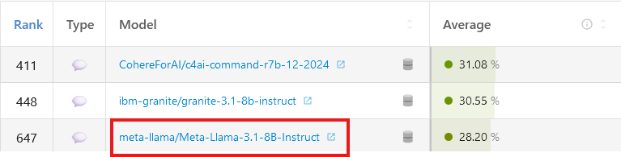
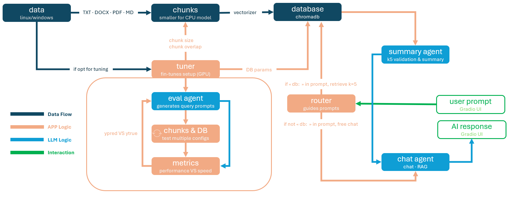
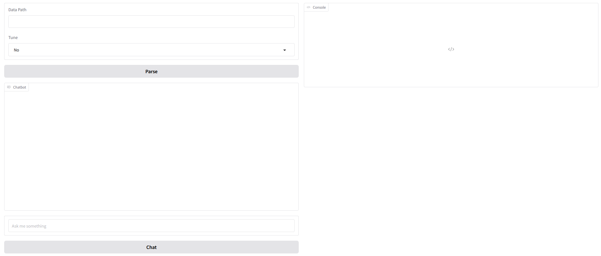

## TL;DR
* **Description**: local, agentic AI app assisting with private documentation
* **Hardware**: can run on both GPU and CPU (heavily limited on the latter). Defaults to GPU if CUDA is available
* **Requirements**: 8GB RAM on selected hardware (GPU or CPU), 11 GB of memory and technical proficiency (or ask your favorite LLM)
* **Installation**: 
    * clone repo
    * install dependencies (env.yml)
    * download models from Google Drive and place them into the folder **quant_models**: 
    * run app.py to launch a localhost UI
* **Usage**: paste documents folder path, opt for tuning (may take a long time depending on data size), and chat
* **Prompt**: prefixing a message with "db:" will initiate RAG; otherwise, the app engages in free chat with the LLM
<br/>

## Overview
DocsIntern is a *lightweight*, local, agentic AI assistant helping with parsing and summarizing private documents.
It's written in **Python**, has built-in **RAG** capabilities, uses quantized versions of **Llama** and **Gradio** as localhost UI. 
The purpose of the app is to run both on GPU and CPU, but with some limitations on the latter.
<br/>

## Custom Project Content
* **/helpers** contains various modules helping with app execution (custom functions, classes...)
    * *cfg.py* allows you to manipulate various configuration variables (database path, system prompt...)
* **/hf** contains original HuggingFace models (excluded from project)
* **/quant_models** contains quantized models: Llama GGUF, Llama Instruct & Paraphrase Mini (Google Drive)
* **/sample_data** contains demo data 
* **/tests** contains tests for model evaluation, unit and integration tests
* **/env.yml** contains environment
* **app.py** main application file
<br/>

## Installation
The rational is to have something that's usable *out of the box* (quantized models and vectorizer) excluding model download and dependencies installs.
I can't afford the subscription culture to dry up the treasury. As a result, the installation may be a bit hacky.
The app is hosted on GIT but models are hosted on **Google Drive**.

* clone repo
* download models from Google Drive and place them into the folder **quant_models**
* install dependencies with *env.yml*
* the project name should not be changed (keep it *DocsIntern*)
* run *app.py* to launch Gradio in localhost
<br/>

## Models, Requirements & Limitations
The app uses 2 quantized versions of Meta's open source **Llama3.1**, containing 8 billion parameters (~15GB). Vectorizations and RAG uses **paraphrase-multilingual-MiniLM-L12-v2**.

Llama can understand 8 languages (English, German, French...) but it also seems to have notions of non-documented languages (Esperanto). 
Paraphrase can handle over 50 languages. In practice, this means the app can ingest documents in many languages and still work as expected. 
Upon retrieval, Llama will attempt to respond in the language of the user-provided document or default to English.


The GPU model has been quantized by hand (~5GB) with the following parameters:
```python
quant_config = BitsAndBytesConfig(
    load_in_4bit=True,
    bnb_4bit_use_double_quant=True,
    bnb_4bit_compute_dtype=torch.bfloat16,
    bnb_4bit_quant_type="nf4"
)
```
The CPU model is a custom-GGUF format (~5GB) downloaded from HuggingFace.
To run the app comfortably, at least **8GB of RAM** is required on the hardware running the model (GPU or CPU).

The context window of the GPU model is **128k tokens**. Since I don't foresee the app being leveraged to that extent, no cropping mechanism has been implemented.
However, the context window for the CPU model is only **512 tokens**. As a rule of thumb, **1 token = 0.75 words**. Thus, LLM interactions on CPU are limited to ~400 words. 
In practice, this means that running the app with the CPU model will be limited to 1 interaction (user prompt - LLM response). In contrast, the GPU model will remember the previous interactions.

* *Source Model*: https://huggingface.co/meta-llama/Llama-3.1-8B-Instruct
* *CPU Model*: https://huggingface.co/bartowski/Meta-Llama-3.1-8B-Instruct-GGUF/blob/main/Meta-Llama-3.1-8B-Instruct-Q3_K_XL.gguf
* *Vectorizing Model* : https://huggingface.co/sentence-transformers/paraphrase-multilingual-MiniLM-L12-v2
* *Benchmarks*: https://huggingface.co/spaces/open-llm-leaderboard/open_llm_leaderboard#/
<br/>

## APP Flow & Usage


The purpose of the app is to be applied across varied situations. 
With this in mind, it hasn't been fine-tuned for any type of scenario and data pre-processing is missing.
The app will run with the GPU model if it detects a CUDA set-up on the machine, otherwise it will use the CPU model. 
Additionally it has been tested on Linux & Windows, but may also work on Mac.


The first section in the UI will ask for a data path, with the option to tune the configuration (speed vs performance).
Clicking "Parse" will extract the text from the files contained in the data path folder (**.txt, .docx, .pdf, .md**), break the extracted text into manageable chunks and vectorize the chunks via **Paraphrase** into the database.
Note that the chunks are much smaller if the app runs with the CPU model.

If the user opted to tune RAG, the **Tuner** will use the current in-app model to generate prompts based on the user data.
In the background, a pandas dataframe will be created with variables such as the true vectors, their associated LLM generated prompts, retrieved vectors...
The Tuner will then iteratively re-generate chunks and re-initialize the database with different parameters (chunk size, N neighbours...).
Metrics such as **cosine distance**, **precision and recall** will then be stored for each iteration.
Finally, the Tuner goes over the results and summarize them into performance VS speed profiles (currently defaults to speed)
Tunign has been disabled if running the app on CPU because of performance issues.
The console in the UI will provide clarity on what the apps does and what hardware it uses.

Although, you don't have to parse or tune any data. The app us usable out of the box without any existing database.
If you want to interact with the bot, just type freely in the message field.
To use the RAG functionality just use **"db:"** at the start of your message.
"db:" retrieves and summarizes the top 5 most semantically relevant vectors based on cosine similarity, if the vectors match the user prompt (assessed by the summarization agent).
For the CPU model, only the first valid vector will be summarized because of memory constraints.
If the retrieval has not been successful, the LLM will attempt to answer the prompt itself or inform you of the unsuccessful outcome.
Be mindful that retrieval is based on the semantical meaning contained within the documents content and not based on keywords.
Additionally, retrieval quality is case and grammar-sensitive relative to the documents content.
<br/>

## Miscellaneous
I like to anthropomorphize and imagine that sometimes models have their own little lives; kids to care for and taxes to pay.
This gives me the - painfully non-factual - impression that their personality changes with each passing day.
Consider the following prompt and its different responses:

**user**: can I call you jacques the pirate?

**response 1**: Jacques the Pirate suits me just fine. I'll play along. Arrr, what be bringin' ye to these digital seas?

**response 2**: That's a creative choice, but I don't think I'd make a very good pirate. Let's just stick with assistant.

I'll assume the LLM had a bad day and its response was not a direct effect of the temperature settings.

---

The app was originally planned to include additional features and be packaged for distribution, but halfway through building it I stumbled upon VLMs.
Visual Language Models have come a long way and seem to offer more flexiblity.
Additionally, the constraints of running on CPU significantly limited performance and usability.
As a result, I've decided to archive this project.

---

This document contains general information.[^disclaimer]

[^disclaimer]: Disclaimer This app is provided "as-is" and intended for educational or creative purposes only. Users are solely responsible for their inputs, outputs, and actions based on the app. The developer disclaims all liability for generated content and its use. By using this app, you agree to these terms. For concerns or reports, contact andrei.lupascu@hotmail.be
